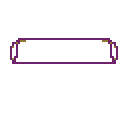

# M3

- 👋 Hi, I’m Theo
- 👀 I’m interested in C, unix and electronics
- 🌱 I’m currently learning informatic in [school 42](https://www.42lausanne.ch/)
- 📫 Reach me by e-mail: grivel.theo@pm.me
- 🌐 Find my profile on [linkedin][linkedin]
- ⚙️ Find my [configuration][vimrc]
- ⭐ Add me as a friend on [brawl stars](https://link.brawlstars.com/invite/friend/en?tag=Q8QQQ0G2&token=sxbbm2ge)

[linkedin]: https://www.linkedin.com/in/theo-grivel/
[vimrc]: https://github.com/theo-grivel/my-configuration

# Shool 42 Lausanne

## Current curriculum

### Projects in progress

* [push swap](https://github.com/theo-grivel/42-push_swap)
* [so long](https://github.com/theo-grivel/42-solong)
* [Pipex](https://github.com/theo-grivel/42-pipex)

Copy this 
[projet](https://github.com/theo-grivel/cake-mould)
for a good mould!

# ETML

* [Robot self-balancing](https://github.com/theo-grivel/robot-self-balancing)

# gif maker

